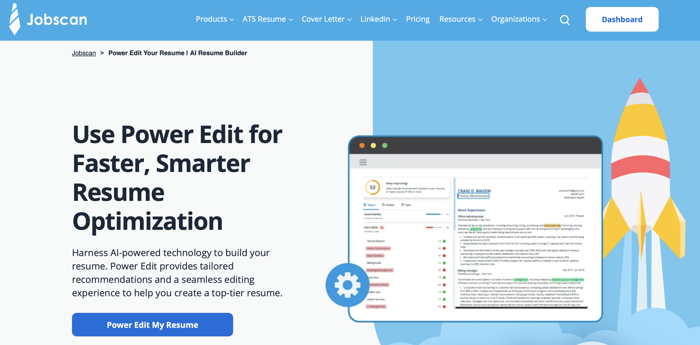
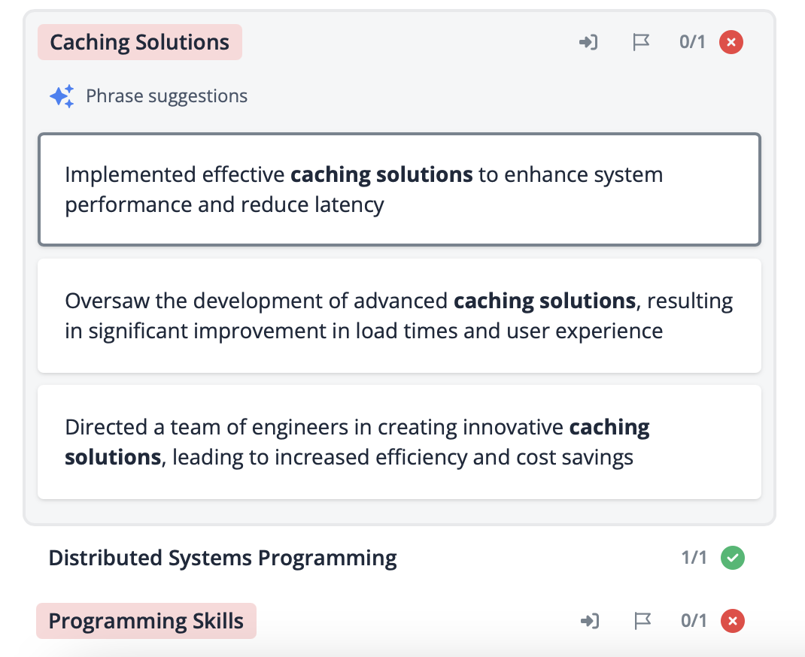
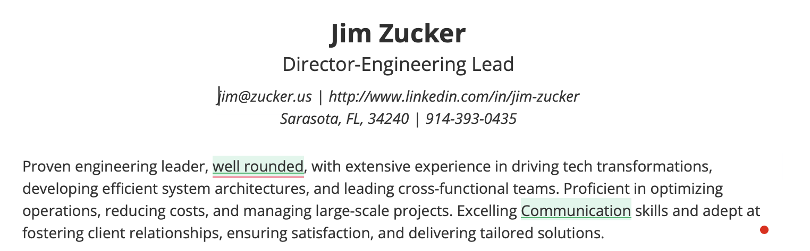
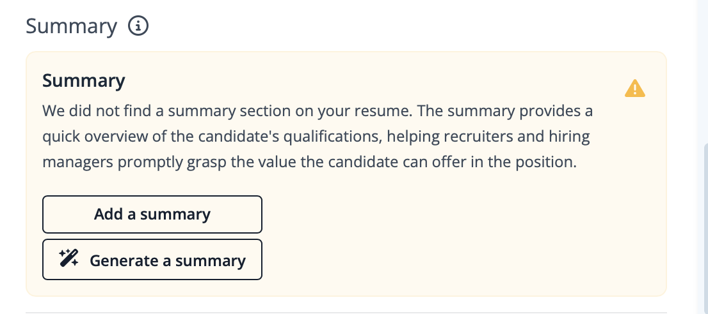
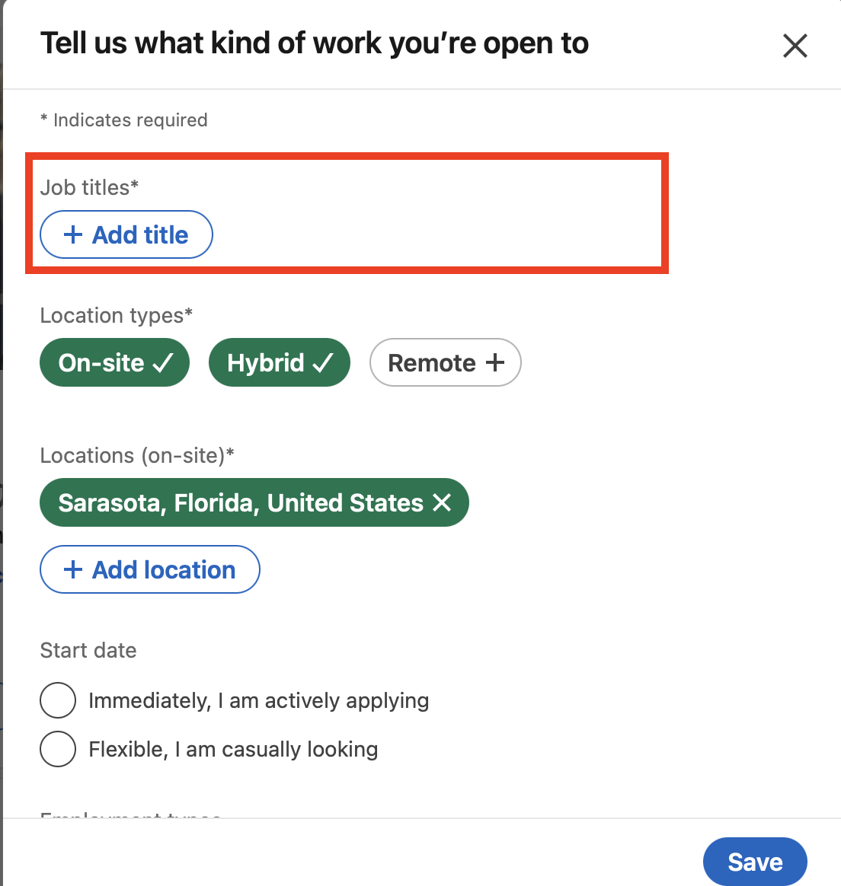
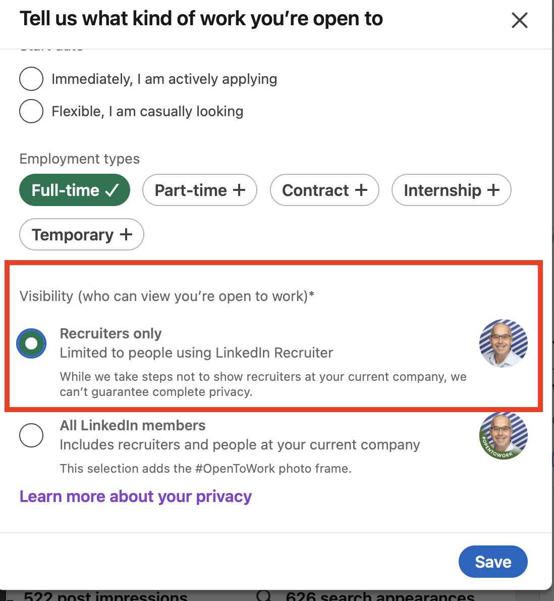
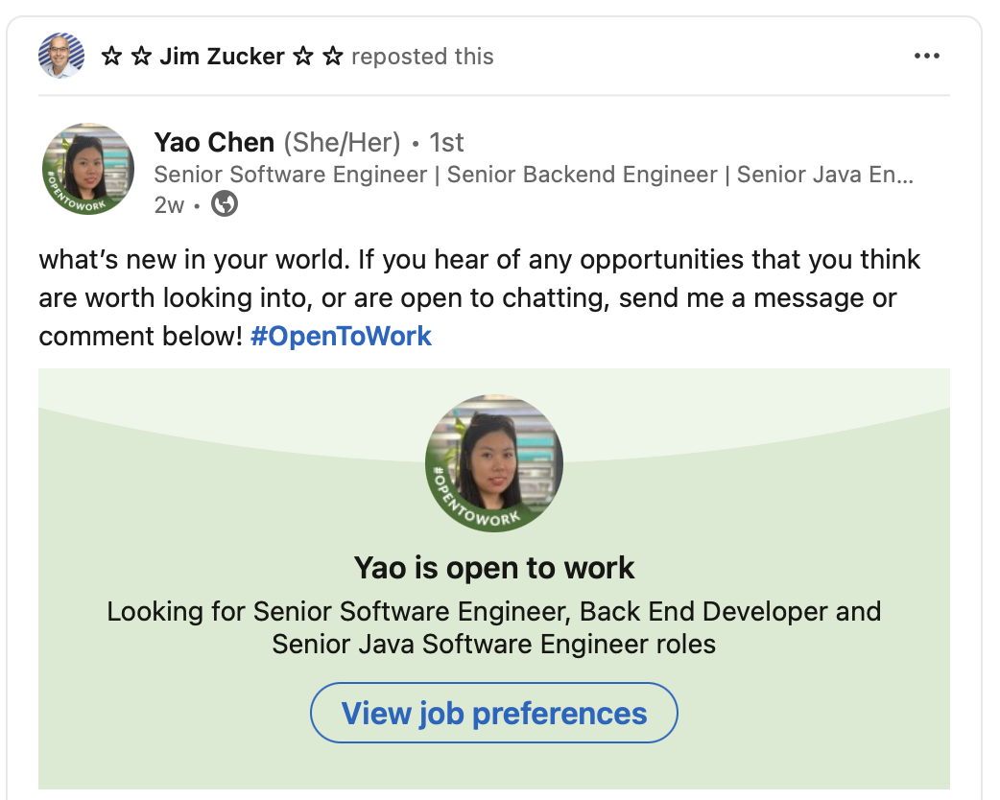
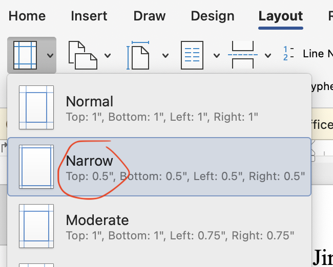

# Hitch Hikers Guild to Job Searches

Based on trial and error and reading a lot of blogs here are the tips and tricks I found to making it easy for Recruiters and Hiring Managers to find you and relate you to a job they are looking for.  

  
## STEP 1: Pick a job title to focus on

__PICK ONE!__

Go through LinkedIn and find what primary job title you want to apply to.

What you will find is titles like 'Delivery Manager', 'VP of Credit Derivatives', '<my product> UI Engineer', MD of Structured Products", etc are not industry standard titles. Although these titles will query jobs when resumes are reviewed 'exact matches' make it easier for the ATS & Hiring process to recognize your resume is a match.

You will find titles like 'Senior Software Developer', 'Solutions Architect', and 'Engineering Manager' are standard industry titles

## STEP 2: How to check if your resume will pass ATS?
Test it with tools like Jobscan or Resume Worded to ensure it's ATS-friendly. These checks optimize keyword usage, format, and overall compatibility. Don't overlook this step—it could make a difference in landing your desired job!

### I selected jobscan.co(there are others)
It's about $70 for a 3-month subscription, and you get 2 free scans to play with it.
Here is a link for a trial:  [jobscan.io trial](https://www.jobscan.co?ref=4767321&utm_source=referral-program&utm_medium=referral&utm_campaign=10-scan-referral-program)

  

## STEP 3: Score your current Resume
Run your LinkedIn profile and resume through it using the Job Descriptions you think you are a perfect fit for and you will see your score is far off from what you expect.

### Job Title
Now for the resume, Change the job title at the top of your resume and similar jobs to have the exact title char for char in the JD and watch your score jump.

The key lesson here is you need to use the job title for the specific job, even if yours is similar if they have 'Manger, Engineering' and you have 'Engineering Manager' CHANGE IT. Look at my LI profile and see what I did with the 'AWS Solutions Architect' and 'Engineering Manager titles. [Jim Zucker LinkedIn Profile](https://www.linkedin.com/in/jim-zucker/)

## STEP 4: Create a standard resume
Pick one job and tune it to get a high score like 80%+, some tips on the tool:

a. Make sure you have 'Core Skills', and 'Certifications' sections, add them using the edit feature in the tool

b. You can add hard/soft skills to the skills sections, look for things you have that are close, and rename them

c. Look through your bullets and reword things using the terms you see that you don't have to increase your score.

d. Now if you click on a skill it will give you recommended bullets

  

e. Once you are at 75%+ remove your summary and use the tool to auto generate one for you with AI it's pretty cool.

  
  

  

### Example resume before and after  
- [My resume 'Before using JobScan'](examples/before-JimZucker.pdf)  
- [My resume 'After tunning with JobScan'](examples/after-JimZucker.pdf)  

## STEP 5: Update your LinkedIn Profile to match the resume

WARNING: Don't publish yet, we will do that when we are all done and share it with your network!

You are going to put all of the bullets in your resume into your LinkedIn profile, don't be shy! and use the '♦' bullet like I have in my profile [Jim Zucker LinkedIn Profile](https://www.linkedin.com/in/jim-zucker/)

a. Update each section, I know it hurts to make the titles standard, you can keep your SVP title but make it SVP <standard Title>

b. Make sure your 'Headline' is your chose 'job title' ie AWS Solutions Architect, you can put multiple in format 'title1 | title2' but the more focused are the better.

c. Pick a banner for your linked in page: 
- [10 LinkedIn Background Photo Ideas To Make Your Profile Stand Out](https://www.forbes.com/sites/josephliu/2019/06/17/linkedin-background-photo/)

d. Make sure you have updated your email, contact info and also setup a public URL: 
- [LinkedIn: Customising Your LinkedIn Public Profile URL like a Pro](https://www.linkedin.com/pulse/customising-your-linkedin-public-profile-url-like-pro-darren-keppie/)
- [If your real name is not available as your LinkedIn public URL, what is the next best solution?](https://www.quora.com/If-your-real-name-is-not-available-as-your-LinkedIn-public-URL-what-is-the-next-best-solution)

e. Updae you profile picture: 
- [10 Tips for Taking a Professional LinkedIn Profile Photo](https://www.linkedin.com/business/talent/blog/product-tips/tips-for-taking-professional-linkedin-profile-pictures)

f. Now pile up the skills on each experience, dupicates are OK don't be shy.

g. Make sure you have your certs in the certs section, if you don't have any, get some they are VERY Creditable.  

__Pro-Tips:__ 
- You want to make the process as easy as possible for the recruiters and hiring company.
- Build your brand, if your email is not clear like <first>-<last>@gmail.com create a new one so communications are clear.
- On LinkedIn make sure you have claimed a Public profile & URL and from what I read "first-last" is the best format. [Manage your public profile URL](https://www.linkedin.com/help/linkedin/answer/a542685/)

### Here is one that is easy and worthwhile (it gives you a cert!)
- [Apache Kakfa Fundamentals Accreditation](https://training.confluent.io/channeldetail/apache-kafka-fundamentals-and-accreditation) (This also gives you a cert you can put on your resume!)  

### I recommend everyone does this for SnowFlake to understand what the tech is about(no cert sorry)
- [Zero to Snowflake in 90 minutes](https://www.snowflake.com/webinars/virtual-hands-on-labs/zero-to-snowflake-in-90-minutes-2024-08-21/?utm_source=google&utm_medium=paidsearch&utm_campaign=na-us-en-brand-core-phrase&utm_content=go-rsa-evg-vh-next-vhol-americas&utm_term=c-g-snowflake-p-657474892216&gad_source=1&gbraid=0AAAAADCzRJUUWudt4eBUxV9mZKm7CVe5f&gclid=Cj0KCQjwt4a2BhD6ARIsALgH7DoPWTSfXxDp2RWImU_eOEgRyXOD_-yajSo-NHmZOIGWHq3nu6AaPdkaAhaSEALw_wcB)  

### <u>Certifications to enhance your resume</u>
- [Kafka Developer Certification](https://training.confluent.io/examdetail/confluent-dev)  
- [Kafka DevOps Certification](https://training.confluent.io/examdetail/confluent-cloud-certified-operator®)  
- [AWS Cloud Practitioner(everyone should do this)](https://aws.amazon.com/certification/certified-cloud-practitioner/?trk=1d3789b7-cdfb-4b92-a125-75424f21eaaf&sc_channel=ps&ef_id=Cj0KCQjwt4a2BhD6ARIsALgH7DqindpydyQVY1KA9WOfTpU6QuxoFUStovVb2lfLM4leiygvbYnhzssaArw-EALw_wcB:G:s&s_kwcid=AL!4422!3!508672713544!e!!g!!aws%20cloud%20practitioner!11120345480!106933363382&gbraid=0AAAAADjHtp-zKLuZOSOvKx5U3tDcDdr_K&gclid=Cj0KCQjwt4a2BhD6ARIsALgH7DqindpydyQVY1KA9WOfTpU6QuxoFUStovVb2lfLM4leiygvbYnhzssaArw-EALw_wcB)  
- [AWS Certifications](https://aws.amazon.com/certification/)  
- [Microsoft Azure Training and Certifications](https://azure.microsoft.com/en-us/resources/training-and-certifications#self-directed-training)  
- [Google Cloud Certification](https://cloud.google.com/learn/certification)  
- [Snowflake Certification](https://www.snowflake.com/certifications/)  
  
### Some other great references to ramp up new techs
- [Confluent Developer - hands-on labs](https://developer.confluent.io/?utm_medium=sem&utm_source=google&utm_campaign=ch.sem_br.nonbrand_tp.prs_tgt.dsa_mt.dsa_rgn.namer_lng.eng_dv.all_con.resources&utm_term=&creative=&device=c&placement=&gad_source=1&gbraid=0AAAAADRv2c0fJu7nuIcPD-cwX9-Z6qCN6&gclid=Cj0KCQjwt4a2BhD6ARIsALgH7DpQmmmNS6f74ddqjZVEONW9gCvW3zku3sAKRlnEQSj98W-Pd2yKtCsaAiFUEALw_wcB)  
- [Snowflake Hands-On Labs(that give you a cert for your LinkedIn Profile)](https://www.snowflake.com/en/resources/learn/snowflake-essentials-training/)  

## STEP 6: Mark yourself 'OPEN FOR WORK'

Note: If you already are set to this turn it off and back on to publish and get the LinkedIn profile out there!

a. Here put all the 'standard' titles you are interested in, I put 'Solutions Architect' and 'Engineering Manager'

  

b. You can set open for work and only make it visible to recruiters

    

c. YOU WANT PUBLISH to your network if you are being PUBLIC!!

  
  
## STEP 7: Update your Resume on LinkedIn and all the job boards
Note: you can make it searchable to recruiters only and you won't get that 'open to work' banner on your profile picture.

a. Your LinkedIn profile has a resume, also make sure you have contact info, email, and cell phone, so when you reply to a recruiter you can share it with them automatically when prompted. [Instructions to update resume on LinkedIn](update-LinkedIn-resume.md)

b. Setup profiles on all of these boards nd make your resume searchable:
- [careerbuilder.com](https://www.careerbuilder.com)
- [dice.com](https://www.dice.com)  
- [eFinancialcareers.co.uk](https://www.efinancialcareers.co.uk)  
- [glassdoor.com](https://www.glassdoor.com/Community/index.htm)
- [ihireengineering](https://www.ihireengineering.com/candidate/jobpreferences/updatejobstatus)  
- [jobleads.com](https://www.jobleads.com/home)
- [linkedin.com](https://www.linkedin.com/in/jim-zucker/)
- [talentify.io](https://www.talentify.io)  
- [theladders.com](https://www.theladders.com)
- [wellfounded.com](https://wellfound.com)  
  
  
## STEP 8: Apply to 3-10(ideally 10) jobs per day
Take the time to create a custom resume using jobscan.co. From my experience I had 125-190 rejects submitting without taking the time to do this. The first day I did this for AWS and a recruiter called me the next day.

a. Tune the resume to at least 75% in jobscan.co for each job, change your title to match the JD exactly, remove tiltes unrealed so you don't cause confusion.

b. Don't forget to delete and generate a new summary (I usually update it to add some of the soft/hard skills after AI is done)

<i>TIP: Download the resume as a Word doc, suggest you change margins to 'narrow' and in some places like before core skills there are 2 blank lines remove one, try to keep the resume to 3 pages, if I'm able to do it, all of you should be able to.</i>

  

c. After the resume is tunned, check the cover letter AI generator It is pretty cool

# Some great self-paced training opportunities

## Intro to New Techs almost anyone can do these
- [Zero to Snowflake in 90 minutes](https://www.snowflake.com/webinars/virtual-hands-on-labs/zero-to-snowflake-in-90-minutes-2024-08-21/?utm_source=google&utm_medium=paidsearch&utm_campaign=na-us-en-brand-core-phrase&utm_content=go-rsa-evg-vh-next-vhol-americas&utm_term=c-g-snowflake-p-657474892216&gad_source=1&gbraid=0AAAAADCzRJUUWudt4eBUxV9mZKm7CVe5f&gclid=Cj0KCQjwt4a2BhD6ARIsALgH7DoPWTSfXxDp2RWImU_eOEgRyXOD_-yajSo-NHmZOIGWHq3nu6AaPdkaAhaSEALw_wcB)  

## These are more technical but not time consuming
- [Hands On: Your First Apache Kafka® Application in 10 Minutes or Less](https://developer.confluent.io/courses/apache-kafka/get-started-hands-on/?utm_medium=nurtureemail&utm_campaign=tm.lifecycle_cd.developer-journey-nurture-using-kafka-email-8_prg.dj_rgn.global_&utm_source=marketo&mkt_tok=NTgyLVFIWC0yNjIAAAGVD7ZVA3Za8J5k49YOxM0XML5uSX562gY6hYctn1Q1y8cvI7ZTxDeV215kCNeVnoefezwVkxjFKExJp4dWx2n-OrdvoH_67zbLyFHMnt67b2MJRLE)  
- [Apache Kakfa Fundamentals Accreditation](https://training.confluent.io/channeldetail/apache-kafka-fundamentals-and-accreditation) (This also gives you a cert you can put on your resume!) 

## These are super but technical and take a little time.
- [Learn Apache Kafka® & Flink®](https://developer.confluent.io/courses/#fundamentals)
- [Your Guide to Flink SQL: An In-Depth Exploration](https://www.confluent.io/blog/getting-started-with-apache-flink-sql/)
- [Snowflake HANDS ON ESSENTIALS - Essentials Workshops are highly interactive, totally free, self-paced, online courses for learners who are new to Snowflake or new to data work in general **These give you badges that can generate LinkedIn posts and you can add to your LinkedIn Profile!**](https://www.snowflake.com/en/resources/learn/snowflake-essentials-training/)

