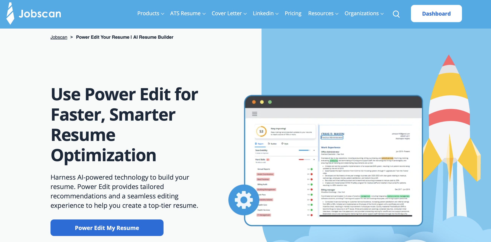
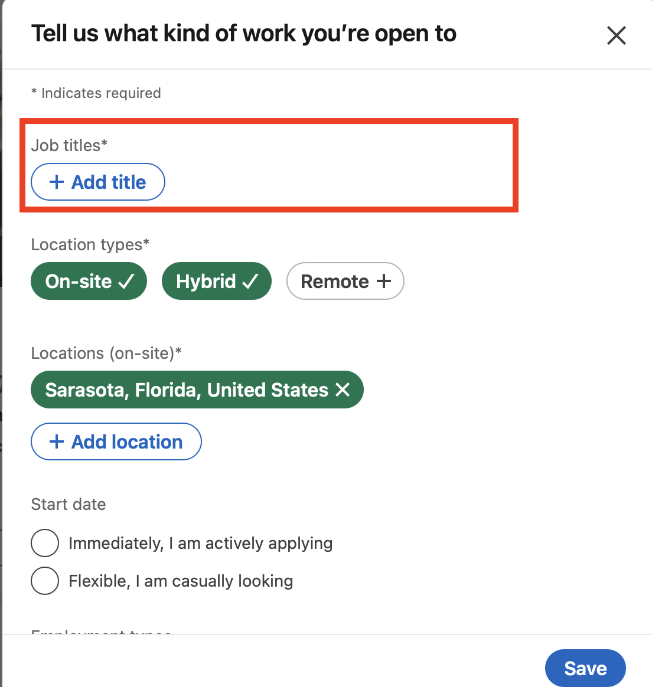
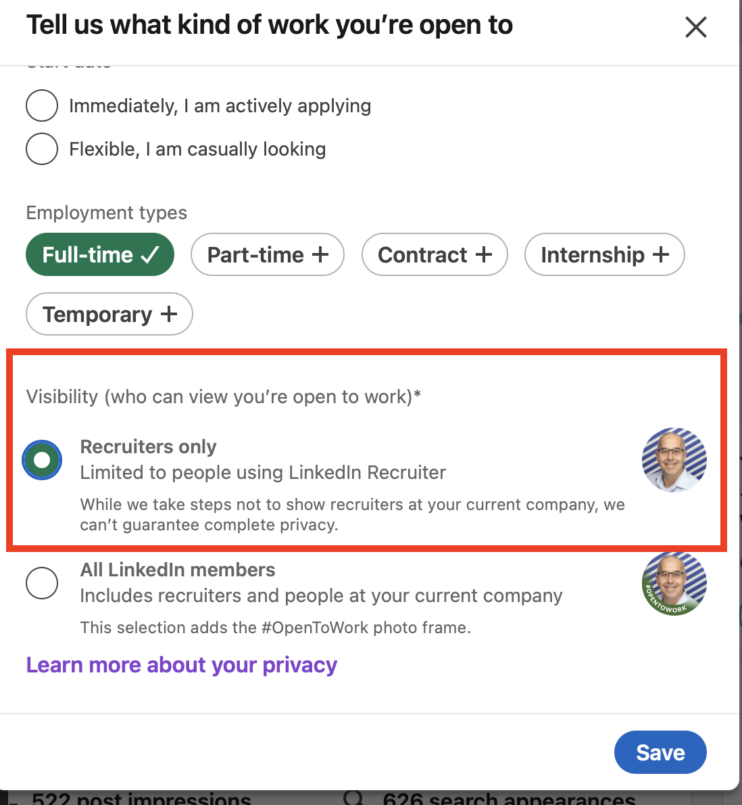
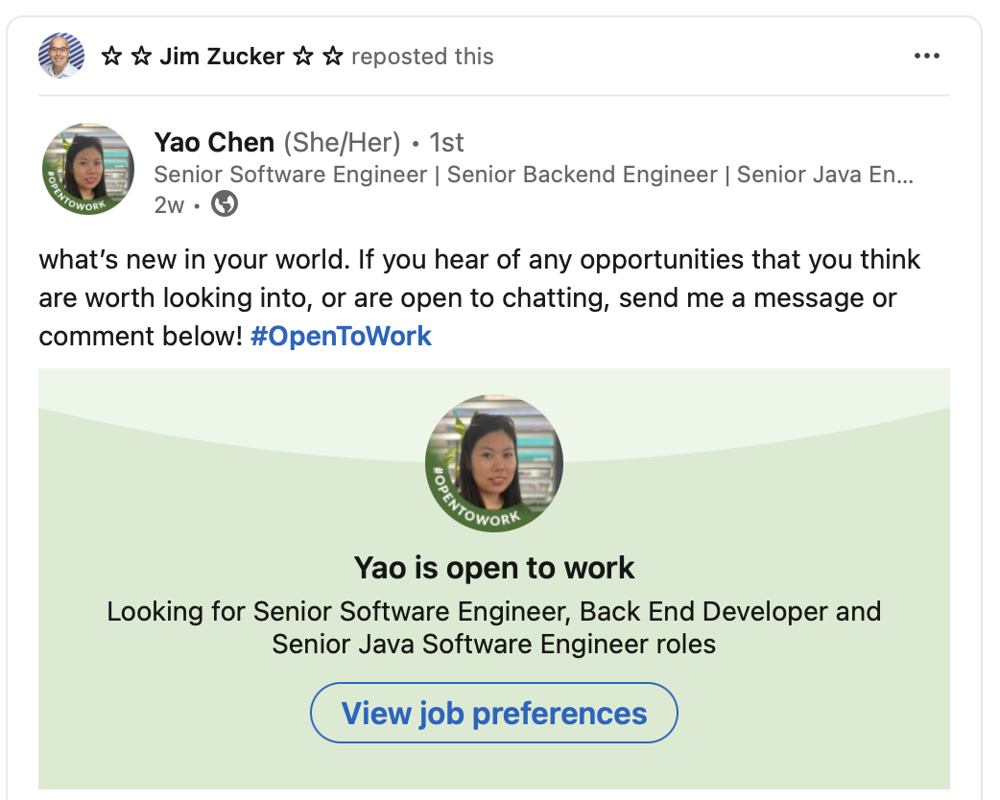
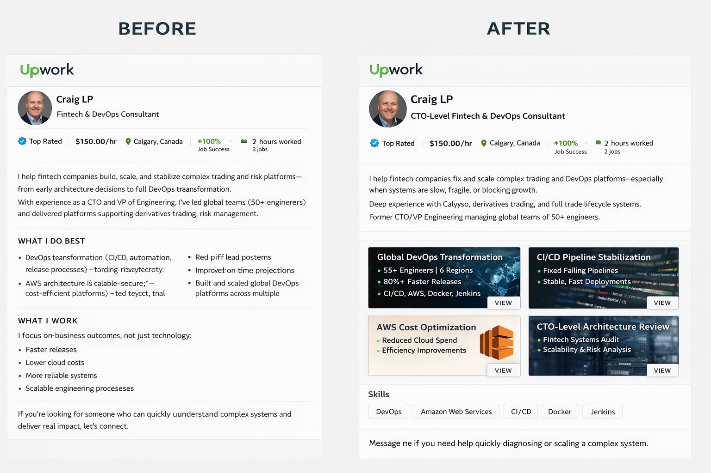
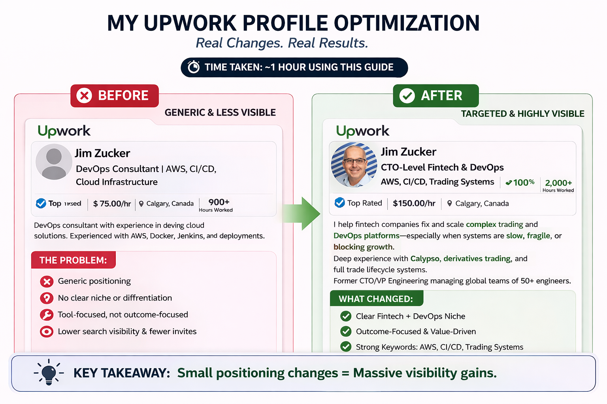

# 🚀 The Hitchhiker’s Guide to Job Searches

### How to Get Found by Recruiters (Instead of Applying Into the Void)

---

## 💡 What This Is

This is a **practical system** I figured out through trial and error.

The goal is simple:

* get more recruiter outreach
* pass ATS filters
* make it obvious what jobs you fit

👉 This is not generic advice
👉 This is how hiring actually works

---

## 🎯 What You Should Expect

If you follow this:

* 📈 2–5x more recruiter outreach (within weeks)
* 🎯 75%+ ATS match scores
* 💼 better, more relevant opportunities

---

## ⚙️ How Hiring Actually Works

Most people think applying to jobs is the main path.

It’s not.

Recruiters search first.

They use LinkedIn + ATS systems and look for:

* exact job titles
* keyword matches
* profiles that clearly match the role

If your profile doesn’t match what they search for, you won’t show up.

That’s why people send out 100+ applications and get nothing back.

---

## 🎯 The Goal

You are not trying to “apply better”.

You are trying to:

👉 show up in recruiter searches
👉 look like an exact match
👉 make it easy for them to reach out

Everything below is built around that.

---

# STEP 1: Pick a Job Title to Focus On

**PICK ONE.**

Go on LinkedIn and figure out the main job title you want.

You will see titles like:

* Delivery Manager
* VP of Credit Derivatives
* UI Engineer
* MD of Structured Products

A lot of these are **not standard**.

ATS systems care about **exact matches**.

Better titles:

* Senior Software Developer
* Solutions Architect
* Engineering Manager

👉 Pick one and stick to it.

---

# STEP 2: Check if Your Resume Passes ATS

Use tools like:

* Jobscan

This checks:

* keywords
* formatting
* ATS compatibility

👉 Do not skip this

I used Jobscan (~$70 for 3 months, 2 free scans)

https://www.jobscan.co/?ref=4767321&utm_source=referral-program&utm_medium=referral&utm_campaign=10-scan-referral-program

---

# STEP 3: Score Your Resume

Run your resume + LinkedIn against job descriptions.

Your score will probably be lower than expected.

## Job Title Matters

Match the job title **exactly**.

Example:

* JD: Manager, Engineering
* You: Engineering Manager

👉 Change it

Yes it’s dumb. Do it anyway.

It works.

---

# STEP 4: Build One Strong Resume

Pick ONE job and optimize for it.

Target:

👉 75–80%+ score

Do this:

* add Core Skills
* add Certifications
* rename skills to match JD
* rewrite bullets using keywords

Once you hit ~75%:

👉 delete summary and auto-generate one

---

# 📊 Real Example (Resume Optimization)

---

# STEP 5: Make LinkedIn Match Your Resume

Recruiters compare both.

Do this:

* copy resume bullets into LinkedIn
* use strong bullets (don’t be shy)
* make headline your job title

Example:

**AWS Solutions Architect | Engineering Manager**

Also:

* clean email
* public URL (first-last)
* good photo
* add skills (duplicates OK)
* add certifications

👉 Goal: make it obvious in 10 seconds

---

# STEP 6: Turn On “Open to Work”

If already on:

👉 turn OFF → ON again

---

### Add Standard Titles

---

### Recruiter Only

---

### Post Publicly (Optional)

---

# STEP 7: Put Your Resume Everywhere

Upload + make searchable:

* LinkedIn
* Dice
* Glassdoor
* CareerBuilder
* Wellfound
* Talentify
* TheLadders

👉 More visibility = more inbound

---

# 🌐 STEP 8: Upwork Optimization

👉 Full guide:
https://github.com/jimzucker/hitchhikers-guide-jobsearch

---

## 🎯 Goal

Not money (at first).

Goal:

* experience
* proof
* credibility

---

## ⚙️ Profile Setup

### Title (Most Important)

Bad:

* DevOps Engineer

Good:

* **CTO-Level Fintech & DevOps | AWS, CI/CD, Trading Systems**

👉 Match search behavior

---

### Description

Structure:

* what you do
* who you help
* what results you deliver

Example:

> I help fintech companies build and scale trading platforms using AWS, Kafka, and CI/CD pipelines.

---

### Portfolio (CRITICAL)

Create 3–5 items:

* Kafka project
* AWS architecture
* CI/CD pipeline
* trading system
* cost optimization

Each:

* short description
* 3–5 skills
* what you delivered

👉 Proof > claims

---

## 📊 Real Example (My Profile)

---

## 🧠 What Changed

### Title

* ❌ Generic
* ✅ CTO-Level Fintech & DevOps

### Positioning

* ❌ “I do DevOps”
* ✅ “I help fintech companies build trading systems”

### Proof

* ❌ none
* ✅ portfolio

👉 That’s it

---

# STEP 9: (Optional) Track Your Work

Use JIRA / Kanban:

* To Do
* Planned
* In Progress
* Done

Treat job search like a project.

---

# STEP 10: Apply Smarter

3–10 jobs/day.

But:

👉 customize resume
👉 match title exactly
👉 hit 75%+ score

This is what actually works.

---

# STEP 11: Stay Active

Once per week:

* post something
* share progress
* show certifications

Also:

👉 attend 1 webinar/week

---

# 🔥 Final Thought

Make it easy for recruiters.

If they don’t quickly understand:

* what you do
* what jobs you fit
* why you match

👉 they move on

---

## ⚡ Summary

This is the system:

1. Pick a job title
2. Optimize resume for ATS
3. Match LinkedIn
4. Show proof (portfolio)
5. Get visibility
6. Apply smart

Do this consistently:

👉 you will get inbound

---

## 👉 One Rule

**Show proof, not claims.**
